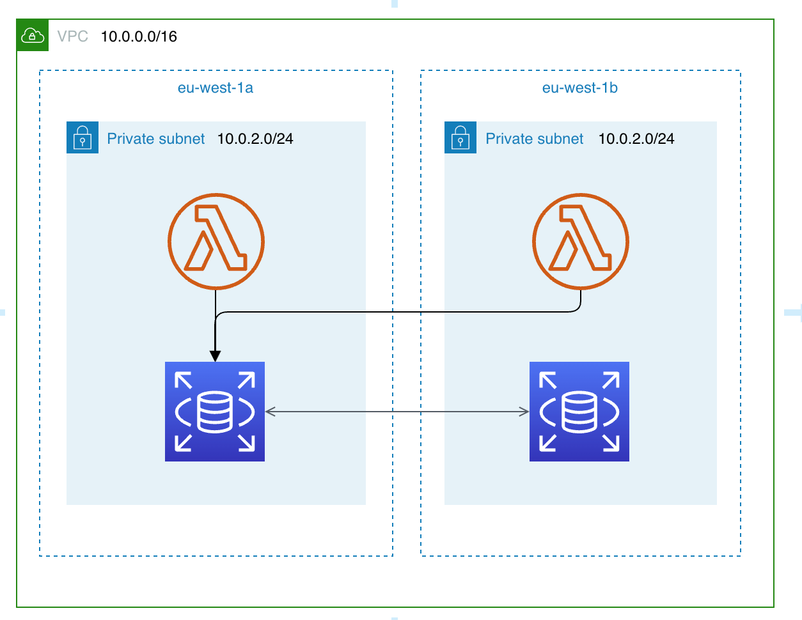

# Configuración de Conexión AWS Lambda + RDS PostgreSQL

## Descripción General
Este proyecto configura una función AWS Lambda que se conecta a una base de datos RDS PostgreSQL dentro de una VPC. La infraestructura está definida utilizando Terraform, proporcionando un proceso de despliegue reproducible y mantenible.



## Arquitectura
La solución crea los siguientes recursos:
- Una VPC con soporte DNS
- Dos subredes en diferentes zonas de disponibilidad
- Grupos de seguridad para RDS y Lambda
- Una instancia RDS PostgreSQL
- Una función Lambda configurada para conectarse a la base de datos
- Roles y políticas IAM para la ejecución de Lambda
- Secrets Manager para las credenciales de la base de datos

## Requisitos Previos
- Cuenta AWS con permisos apropiados
- Terraform instalado
- AWS CLI configurado

## Componentes de Infraestructura

### Redes
- **VPC**: Entorno de red aislado con bloque CIDR 10.0.0.0/16
- **Subredes**: Dos subredes en diferentes zonas de disponibilidad para alta disponibilidad
- **Grupos de Seguridad**: Grupos de seguridad separados para RDS y Lambda con reglas apropiadas

### Base de Datos
- **RDS PostgreSQL**: Una instancia t3.micro ejecutando PostgreSQL 16.3
- **Grupo de Subredes DB**: Abarca dos zonas de disponibilidad para alta disponibilidad
- **Autenticación IAM**: Habilitada para mayor seguridad

### Función Lambda
- **Runtime Python 3.9**: Ejecuta una función que se conecta a la base de datos
- **Integración VPC**: Ubicada en la misma VPC que la instancia RDS
- **Variables de Entorno**: Detalles de conexión a la base de datos transmitidos de forma segura

### Seguridad
- **Roles IAM**: Principios de privilegio mínimo aplicados
- **Reglas de Grupo de Seguridad**: Reglas específicas de entrada/salida
- **Secrets Manager**: Almacena credenciales de base de datos de forma segura

## Configuración
La función Lambda se conecta a PostgreSQL utilizando el controlador pg8000. Las variables de entorno clave incluyen:
- RDS_HOST: Punto de conexión de la base de datos
- RDS_USER: Nombre de usuario de la base de datos
- RDS_PASS: Contraseña de la base de datos
- RDS_DB: Nombre de la base de datos

## Despliegue
1. Clonar este repositorio
2. Establecer las variables requeridas en un archivo `terraform.tfvars` o variables de entorno
3. Ejecutar:
```bash
terraform init
terraform plan
terraform apply
```

## Notas Importantes
- La configuración asume la región `eu-central-1` para los recursos
- Los permisos IAM están configurados con el principio de privilegio mínimo
- Los grupos de seguridad restringen el tráfico solo a lo necesario
- Las conexiones a la base de datos utilizan autenticación IAM para mayor seguridad

## Solución de Problemas
- Si ocurren tiempos de espera en la conexión, verificar las reglas de grupo de seguridad
- Revisar los registros de ejecución de Lambda para mensajes de error detallados
- Asegurar que la función Lambda tenga los permisos apropiados de acceso a VPC

## Evidencia
Para verificar que la función Lambda se conecta correctamente a la base de datos RDS, se puede revisar el registro de ejecución de Lambda en CloudWatch. A continuación se muestra un ejemplo de salida exitosa de un test de conexión:


## Limpieza
Para destruir todos los recursos creados por esta configuración:
```bash
terraform destroy
```
